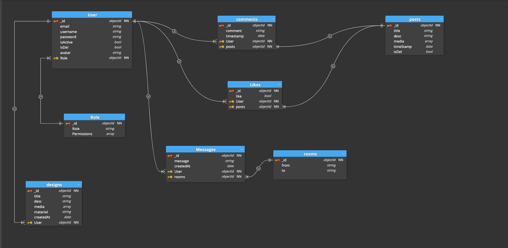
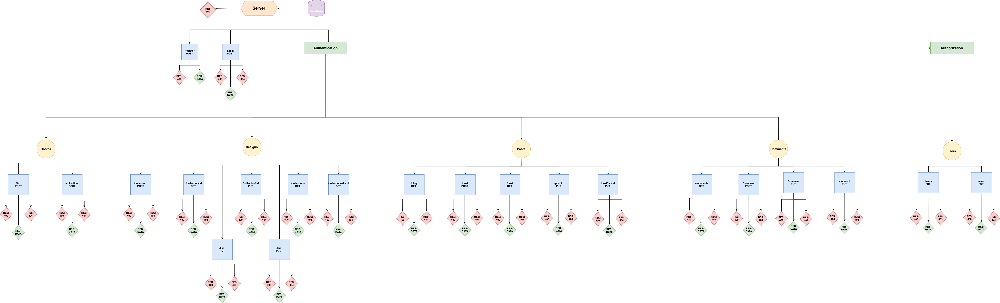

# Server / Backend
# Tuwaiq - Masterpiece-Project

# Description

this is server side for fashion site , built with Express.js , it's a platform that gathers fashion designers with their clients , and let them share their experiences , ideas in a timeline blog 


## Installing Dependencies

##### Node js:

Follow instructions to install the latest version of Node js for your application in the [Node js docs](https://nodejs.org/en/)

##### NPM Dependencies:

Once you have the project in your local machine, install dependencies by running:

```
npm install
```


**now you have to install required packages:**

- [Express:](https://expressjs.com/en/starter/installing.html)
  Express is a minimal and flexible Node.js web application framework that provides a robust set of features for web and mobile applications.

```
npm i express

```

- [Mongoose: ](https://docs.mongodb.com/manual/installation/) Mongoose is an Object Data Modeling (ODM) library for MongoDB and Node.js. It manages relationships between data, provides schema validation, and is used to translate between objects in code and the representation of those objects in MongoDB.

```
npm i mongoose
```

- [Morgan:](https://www.npmjs.com/package/morgan) morgan is a Node. js and Express middleware to log HTTP requests and errors, and simplifies the process.

```
npm i morgan
```

- [CORS: ](https://www.npmjs.com/package/cors) cors is a Node. js and Express middleware it allows you to make requests from one website to another website in the browser.

```
npm i cors
```

- [Bcrypt:](https://www.npmjs.com/package/bcrypt)
  bcrypt is a library on NPM makes it really easy to hash and compare passwords in Node.

```
npm i bcrypt
```

- [JWT : ](https://www.npmjs.com/search?q=jwt) The JSON web token (JWT) is one method for allowing authentication, without actually storing any information about the user on the system itself.

```
npm i jsonwebtoken
```


##### Now Running the Server

Excute this command to run the server in develpment mode

```
npm run dev
```

or run the server on production mode ,excute :

```
npm start
```


## User Story: 
- *signe up* : As an anon you can sign up in the platform so that you can navigate through the app . 
- *Verification* : as a new user ,you will resave an Email with verification Code/Link  , after enter the code/ press the link , you will active your account 

- *Login* : as long as you have an actived account you can login by enter your email/username , and your password . 

- *Login With Google* : user can login by his Gmail account
- *User Profile* : user can edit his information in profile page , like reset his avatar , reset his password , edit first / last name ...etc 

###### Blog Page
- *Add Comments* : in blog page , user can comment on posts .
- *Edit Comments* : also, user can edit his own comments . 
- *Delete Comments* :  user can remove his own comments as well . 
- *Add Likes* : in blog page , user can favorite posts .
- *Unlike* :  user can remove his likes .


###### Designers page 

- *Chatting With Designers* : user can contact with designers in a direct message . 


## Models 

###### Roles 

| Key               | Type              |       Options               |      Default value      |               
| :---              |     :---:         |        :---:                |        :---:            |
| _id               |     String        |      required, unique       |         n/a             |
| role              |     String        |      required, unique       |         n/a             |


###### users

| Key               | Type              |       Options               |      Default value      |               
| :---              |     :---:         |        :---:                |        :---:            |
| _id               |     String        |      required, unique       |         n/a             |
| email             |     String        |      required, unique       |         n/a             |
| username          |     String        |      required, unique       |         n/a             |
| password          |     String        |      required               |         n/a             |
| isActive          |     Boolean       |                             |         false           |
| isDel             |     Boolean       |                             |        false            |
| role              |     Ref(role)     |      required               |         n/a             |
| avatar            |     String        |                             |         n/a             |


###### Posts

| Key               | Type              |       Options               |      Default value      |               
| :---              |     :---:         |        :---:                |        :---:            |
| _id               |     String        |      required, unique       |         n/a             |
| title             |     String        |      required               |         n/a             |
| desc              |     String        |      required               |         n/a             |
| media             |     Array         |                             |         n/a             |
| createdBy         |     Ref(user)     |                             |         n/a             |
| createdAt         |     Date          |                             |         n/a             |
| isDel             |     Boolean       |                             |         false           |


###### Comments

| Key               | Type              |       Options               |      Default value      |               
| :---              |     :---:         |        :---:                |        :---:            |
| _id               |     String        |      required, unique       |         n/a             |
| comment           |     String        |      required               |         n/a             |
| createdBy         |     Ref(user)     |                             |         n/a             |
| createdAt         |     Date          |                             |         n/a             |
| post              |     Ref(post)     |                             |         n/a             |
| isDel             |     Boolean       |                             |         false           |


###### likes

| Key               | Type              |       Options               |      Default value      |               
| :---              |     :---:         |        :---:                |        :---:            |
| _id               |     String        |      required, unique       |         n/a             |
| like              |     Boolean       |      required               |         false           |
| createdBy         |     Ref(user)     |                             |         n/a             |
| post              |     Ref(post)     |                             |         n/a             |
| isDel             |     Boolean       |                             |         false           |


###### Designs


| Key               | Type              |       Options               |      Default value      |               
| :---              |     :---:         |        :---:                |        :---:            |
| _id               |     String        |      required, unique       |         n/a             |
| title             |     String        |      required               |         n/a             |
| desc              |     String        |      required               |         n/a             |
| media             |     Array         |      required               |         n/a             |
| caregory          |     String        |      required               |         n/a             |
| material          |     String        |      required               |         n/a             |
| createdBy         |     Ref(user)     |                             |         n/a             |
| createdAt         |     Date          |                             |         n/a             |
| isDel             |     Boolean       |                             |         false           |


# Entity Relationship Diagram (ERD)




# API Reference


| HTTP Method       | URL               |       Request Body                    |      Success status     |      Error Status   |    Description   |    
| :---              |     :---:         |        :---:                          |        :---:            |        :---:        |       :---:      |
| POST              |     `/signup`       |      {email, username , password}     |         201             |         404         | check if the user not exists, then create new user with encrypted password , and store it in the database   | 
| POST              |     `/login`        |      {username , password}            |         201             |         404         | check if user exists and the password is correct , then navigate to home page   |
| GET               |     `/blog`         |                                       |         200             |         400         | Used to view all designres's posts in the App  |
| POST              |     `/post`         |      {title, desc, media}             |         201             |         400         | Used to create a new post to the blog  by designer  | 
| PUT               |     `/post/:id`     |      {title , desc, media}            |         200             |         400         | Used to edit a post by designer  | 
| PUT               |  `/post/del/:id`    |             { isDel}                  |         200             |         400         | Used to delete a post (soft delete) by designer  | 
| POST              |    `/collection`    |  { title , desc , media , material}   |         201             |         400         | Used to create a new collection to collections by designer | 
| GET               |    `/collections`   |                                       |         200             |         400         | Used to view all collections    | 
| PUT               |  `/collection/:id`  |  { title , desc , media , material}   |         200             |         400         | Used to edit a collection by the designer | 
| PUT               |  `/collection/:id`  |             { isDel}                  |         200             |         400         | Used to remove a collection by the designer | 
| POST              |     `/comment`      |    { comment, post , user}            |         201             |         400         | Used to create a new comment by the user | 
| GET               |   ` /comments `     |              { post }                 |         200             |         400         | Used to view all post's comments  | 
| PUT               |    `/comment `      |        { id , comment }               |         200             |         400         | Used to edit a comment  | 
| PUT               |    `/comment `      |        { id , isDel }                 |         200             |         400         | Used to delete a comment (soft delete)| 
| POST              |     `/dm `          |    { comment, post , user}            |         201             |         400         | Used to create a new dierct message | 


# UML Diagram 




# Links

#### Trello 

visit my Trello [Here](https://trello.com/b/v5XlqqjM/mp-project-lama)

#### Git
- [Client repository Link](https://github.com/MP-Project-Lama/client)
- [Server repository Link](https://github.com/MP-Project-Lama/server)
- [Deployed App Link ](https://github.com/MP-Project-Lama/server)

#### Slides
 You can find my presentation slides [Here](https://github.com/MP-Project-Lama/server)
